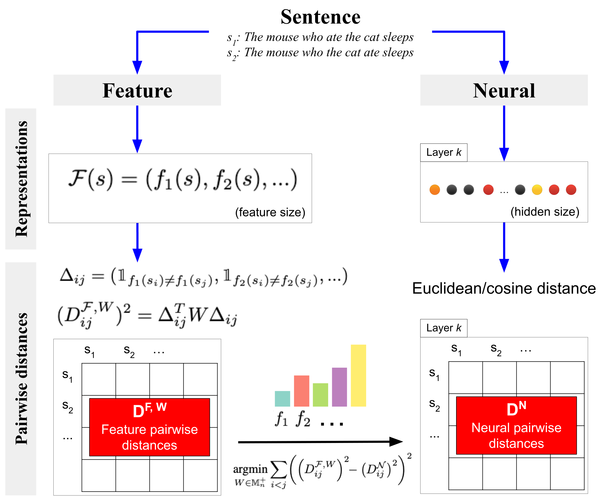

# Metric Learning Encoding Models (MLEMs)

<p align="center">
	
</p>

Paper: **[Metric-Learning Encoding Models Identify Processing Profiles of Linguistic Features in BERT's Representations](https://arxiv.org/abs/2402.11608)**  
Link to the documentation: **https://mlem.readthedocs.io/en/latest/**

## Getting started

Use a recent version of Python, figures in the paper were generated using Python 3.11. 
### Dependencies

```bash
pip install -U -r requirements.txt
git submodule update --init --recursive
```

### Basic script

Basic code block to run at the root of the repository to execute the pipeline with the default parameters:
```python
from MLEM import *
pipeline = MLEMPipeline()
# Display the default parameters and saving directories
print(pipeline)
# Compute the features distance matrix
pipeline.compute_features_distance()
# Compute the Feature Importance for the 12 layers of `bert-base-uncased`
for layer in tqdm(range(1, 13)):
	pipeline.layer = layer
	pipeline.compute_feature_importance()
# Visualize the results
ax = pipeline.plot_feature_importance()
plt.show()
```

## Walkthrough

A walkthrough notebook to use the MLEM pipeline and reproduce the figures from the paper is available at [walkthrough.ipynb](walkthrough.ipynb). Switch to the branch [`precomputed`](https://github.com/LouisJalouzot/MLEM/tree/precomputed) if you want precomputed files.

## Stimulus generation

See this [folder](stimulus_generators_NLMs) for the scripts used to generate the datasets.

## Main parameters and methods

Here and in the code, `{attr}` will refer to the attribute `attr` of the class and `name` will refer either to a parameter of a function or a method of the class. Given a context and the names chosen, there should be no confusion.

### Dataset and model parameters
	- dataset : str, default="short_sentence"
		Name of the dataset. It should be save at `{work_dir}/datasets/{dataset}.csv`, have a sentence column and the other columns will be treated as linguistics features.
    - model : str, default="bert-base-uncased"
		Name of the model on HuggingFace. For a multiberts model, specify the seed and step with the corresponding parameters.
	- layer : int or "net", default=5
		Layer at which the activations should be taken (starting from 1).
	- take_activation_from : {"first-token", "mean", "last-token"}, default="first-token"
		How to aggregate the activations on the dimension of the tokens.

### Pipeline parameters
	- distance_metric : str, default="euclidean"
		Distance metrics used in `sklearn.metrics.pairwise_distances` to compute the distance matrix.
	- conditional : bool, default=False
		If True, Conditional Permutation Feature Importance will be computed. Otherwise only Permutation Feature Importance.
	- top_units_rank : str or None, default=None
		Measure used to sort the units of a given layer. Can be one of {"R2", "R", "MSE", "MAE"} or a feature in the dataset to consider it's feature importance.
	- top_units : int or None, default=None
		Number of top units considered for the order defined with `{top_units_rank}`.

### Practical parameters
	- work_dir : str, Path, default=os.getcwd()
        Working directory.
	- verbose : {0, 1, 2, 3}, default=0
		A higher value means more details on the computation are printed.
	- n_jobs : int, default=-1
        Number of parallel jobs spawned.

### Computing methods
	- compute_feature_importance : computes (top k) multivariate Feature Importance for the current configuration.
	- compute_univariate_feature_importance : computes the univariate Feature Importance for all the units.
	- compute_decoding_baseline : computes the decoding baseline.

### Plotting methods
	- plot_correlation : plots the correlation between the feature in the features distance matrix.
	- plot_feature_importance : plots the multivariate Feature Importance (and the decoding baseline).
	- plot_mds : plots an MDS and highlights the given hierarchy of features
	- barplot_clusters : plots the average univariate Feature Importance on clusters found by KMeans and the silhouette method
	- plot_distrib_univariate : plots the distribution of univariate measure along with the multivariate one
	- plot_top_k : plots the evolution of a multivariate measure when considering more and more units

### Loading methods
	- get_results(method="multivariate") : loads and concatenates dataframes with the results for the given method
	- get_dataset(mds=True) : loads the dataset with the MDS coordinates in the columns "x" and "y"

### The parameter `{skip_existing}`

This parameter allows for specifying if exising files should be recomputed. By default `{skip_existing} = np.inf` meaning that nothing is recomputed. An element is recomputed if a computation is called which requires it and depending on the value of `{skip_existing}` according to those rules:
- `{skip_existing}` $> 0$ skips model activations
- `{skip_existing}` $> 1$ skips distance matrix
- `{skip_existing}` $> 1.5$ skips the MDS matrix
- `{skip_existing}` $> 2$ skips the multivariate/univariate feature importance and decoding baseline